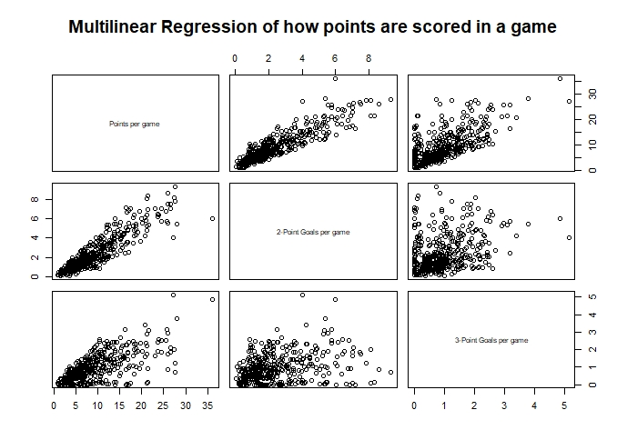

```{r setup, include=FALSE}
knitr::opts_chunk$set(echo = TRUE,
                      message = FALSE,
                      warning = FALSE)

```

<style type="text/css">

body, td {
   font-size: 12px;
}
code.r{
  font-size: 12px;
}
pre {
  font-size: 12px
}
</style>


### Purpose of analysis

In the 2018-19 season, the Chicago Bulls placed 27th out of 30 in the NBA competition. An analysis has been conducted to determine the best starting 5 players that will play for the new season, based on a variety of statistics that were obtained in the 2018-19 season.

### Methods of analysis

There were 4 steps involved in this analysis:

1. Tidy all datasets, ensuring each variable was in a separate column, each observation was on a separate row, each value was in its own cell, and to remove all missing data. 
2. Deciding what key metrics were essential for each position using a Basketball handbook from Kingaroy Basketball (1), and and supporting them with an article from BBC Sport Academy (2). The metrics decided were as follows:

    * Point Guard (PG) - Assists, Turnovers and Assist-to-Turnover Ratio
    * Shooting Guard (SG) - Assists, Rebounds, Field Goal percentage, 3-Point Goal percentage and Points scored per game
    * Small Forward (SF) - Rebounds, Assists and Scoring statistics*
    * Power Forward (PF) - Rebounds per game and Scoring statistics*
    * Centre (C) - Blocks, Rebounds and Scoring statistics*

*Specific scoring statistics were determined further in the analysis by the use of Multi-Linear Regression shown below.

3. Filtering main data set into position specific data, and further according to key metrics to identify best performing players in these metrics.
4. Determine the player that should be signed for the starting spot in their position for the upcoming season, and compare them to the players in that position in the top 5 teams in the 2018-19 season.

### Results of analysis

Prior to the filtering process, the relationship between certain metrics were compared to determine the eligibility for further analysis. The first relationship was how a high Assist-to-Turnover rate can affect points scored in a game. The data used for this was the team data. 

<center>

{width=40%}

</center>

As the graph shows, there is an upward trend, suggesting that as the ATTOVR is high, that is, a high number of assists, and a low number of turnovers, the number of points scored is more likely to rise too. This is due to increased possession usually leading to points.

Next was to determine what type of goals should be used for scoring statistics. A multi-linear regression was conducted comparing the two types of field goals scored in a game, and points scored in a game. After determining that 2-Point goals had the best relationship, a scatter plot was created to show the relationship.

<center>

{width=40%} {width=40%}

</center>

These graphs both indicate that a large proportion of the team's points originate from 2-Point Goals.

Finally, a graph was drawn to show how frequently goals were scored after rebounds, specifically 2-Point Goals. This type of goal was chosen due to the fact that the ball would most likely been obtained in the key, thus 2-Point goals being the more frequently scored points in that zone.

<center>

{width=40%}

</center>

The trend indicates that as rebounds per game, so does 2-Point goals, following the above hypothesis.

#### Point Guard

After filtering point guard players by those that were above average for assists, below average for turnovers and above average for ATTOVR, the data set was narrowed to the top 9 players. Although the top player, `Tyus Jones` had the best ATTOVR, the player I recommend chosing is `Monte Morris`, due to having a high ATTOVR of `5.712`, and also being quite a strong point scorer, scoring almost double the number of points over the season than Jones with `851 points`. Although shooting is not essential for a Point Guard, it will still be helpful to have a 5th player that is a strong pointscorer. When compared to players in the top 5 teams for ATTOVR, of which he is in one, he is the #1 Point Guard, as well as rating high for AST and Points, and relative to assists, has one of the lowest turnovers. Alongside this, at `$1,349,383`, he is one of the cheapest Point Guards in both the Top 5 teams as well as the top 9 filtered point guards.

#### Shooting Guard

To filter out the best shooting guard players, there were a few metrics that were observed. First was selecting the players that were above average in Field Goal Percentage and 3-Point Percentage. The data was then filtered by above average points per game and rebounds per game, leaving the data with 15 players. Alongside this, a general Points Percentage metric was created to show what percentage of points the player scored overall. The player chosen was `Bradley Beal`. He is the top scorer in points per game statistics with `25.60 points`, and is ranked high in all other metrics (Field Goal accuracy of `47.5%`, 3-Point Goal accuracy of `35.1%`, `448` assists, and `411` rebounds. When compared to the players in the top 5 teams to the points he scores per game, he is the top point scorer, scoring 4 points more per game than the second placed player. He is a more expensive player, at `$25,434,262`, however, due to his great statistics, he should prove beneficial for the team.

#### Small Forward

To determine the player best suited for the small forward position, the metrics that were used to refine the data were rebounds, assists and 2-Point Goals (as per results from the multilinear regression above). Another metric was also created, the Rebound-to-2-Point-Goal (RTPG) Ratio. This was to determine the likelihood a 2-Point Goal being scored off the back of an offensive rebound. After the top 11 players were finalised, `Nicolas Batum` was chosen to be the player we sign. Although he he doesnt have a very high offensive rebound statistic (`71`), and subsequently a low RTPG value (`0.518`), he dominates the field in the other rebound (`319` for defensive, and total of `390`) and assist (`247`) stats, is highly ranked in his shooting percentages for all types of goals (2-Point = `51.9%`, 3-Point = `38.9%`, Field Goal Total = `45%`), and also has the highest number of points scored in a game of `9.32 points`. Compared to the top 5 teams, in all metrics, Batum ranks similarly in all rebounds, except for offensive rebounds. In offensive rebounds, he is ranked third. In this data pool, 3 of the overall top 5 teams were included, showing that earning offensive rebounds aren't necessarily a top priority in their game when it comes to scoring points. Due to this, assists per game was the most important metric, as it shows the player's involvement, of which Batum was ranked second in this data pool. With his price at `$24,000,000`, he has an important role in our team, both with his impressive shooting accuracy, ability to obtain defensive rebounds, and his high number of assists.

#### Power Forward

To select the starting power forward player, above average power forwards were filtered by rebounds per game, 2-Point Goal accuracy and the RTPG Ratio. After this process, `John Collins` was chosen as a standout player. Although, according to the RTPG ratio, he is only average, he has the 2nd best 2-Point goal accuracy at `60.9%`, highest count of goals of `410`, and the highest number of rebounds obtained per game of `9.75`. When compared to players in the top 5 teams, Collins is again ranked high for shooting and rebounds, however is around the average for RTPG ratio. At the price of `$2,299,080`, his stats show promising ability, and should be strongly considered for our club.

#### Centre

The selection process of the final position of centre was simple, sorting above average players in blocks, rebounds and 2-Point Goal statistics. Once again, the RTPG Ratio was also used in this position. This process left 11 potential centres to choose from. `Steven Adams` excells in all relevant scoring statistics (Field Goals = `59.5%`, 2-Point Goals = `59.6%`), rebounds (Offensive = `391`, Total = `760`), and the RTPG Ratio (`0.81`), however when it comes to blocking (`76`) and obtaining defensive rebounds (`369`), he is about average in the data pool. Despite this, at just `$24,157,304`, he is a valuable player who should be added to our team. When this player is compared to the centres in the Top 5 teams, he ranks similarly, with high levels in scoring, offensive and total rebounds and RTPG Ratio, and about average in defensive rebounds and blocks.

### Recommendations for the team

According to the above results, the starting team that should be selected is:

* Point Guard - Monte Morris, Denver Nuggets ($1,349,383) - Drill to reduce turnovers - *Machine Gun Passing* (3).
* Shooting Guard - Bradley Beal, Washington Wizards ($25,434,262) - Drill to improve 3-Point Goal Accuracy - *Partner Shooting* (4).
* Small Forward - Nicholas Batum, Charlotte Hornets ($24,000,000) - Drill to improve 3-Point and 2-Point Goal Accuracy - *Partner Shooting*
* Power Forward - John Collins, Atlanta Hawks ($2,299,080) - 3-Point accuracy improved by *Partner Shooting*, drill to improve defensive rebound collection - *Rotation Rebounding* (5)
* Centre - Steven Adams, Oklahoma City Thunder ($24,157,304) - Drills to improve Blocking - *React and Block* (6).

Choosing these players will cost the club \$77,240,029 and will leave \$40,759,971 to spend on other 10 remaining players for the roster This will average approximately $4,075,997, which will buy us some very valuable players, as shown in the data extrapolated during this analysis.

### References

1. Kingaroy Basketball. Basketball positions [Internet]. Kingaroy: Kingaroy Amateur Basketball Association; n.d. [cited 2020 April 19]. Available from: https://websites.sportstg.com/get_file.cgi?id=36250836
2. Academy, BBC Sport. Basketball players [Internet]. London: BBC; 2020 [cited 2020 April 19]. Available from: http://news.bbc.co.uk/sportacademy/bsp/hi/basketball/rules/players/html/default.stm
3. Breakthrough Basketball. Machine gun passing [Internet]. Breakthrough Basketball; 2009. [cited 2020 May 2]. Available from: https://www.breakthroughbasketball.com/drills/machinegunpassing.html
4. Andy Hamilton. Grinnell’s 7 drills to improve 3-point shooting [Internet]. Winning Hoops; n.d. [cited 2020 May 4]. Available from: https://winninghoops.com/article/basketball-grinnell-college-3-point-shooting-drills/
5. Coach Mac. 7 Rebounding Drills (Dominate the Rebounding Battle) [Internet]. Basketball for Coaches; 2017. [cited 2020 April 24]. Available from: https://www.basketballforcoaches.com/rebounding-drills/
6. Jeff Haefner. 8 Drills to create a great shot blocker [Internet]. USA Basketball; 2015 [cited 2020 May 14]. Available from: https://www.usab.com/youth/news/2012/04/8drills-to-create-a-great-shot-blocker.aspx
