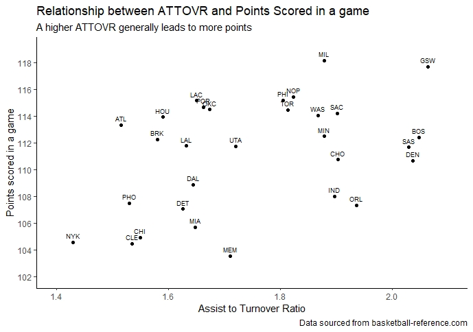
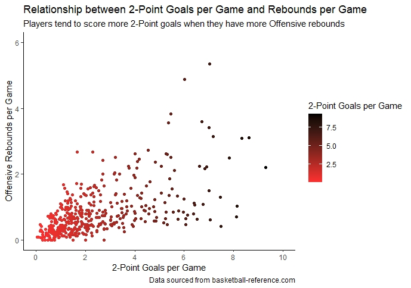

```{r setup, include=FALSE}
knitr::opts_chunk$set(echo = TRUE,
                      message = FALSE,
                      warning = FALSE)

```

<style type="text/css">

body, td {
   font-size: 13px;
}
code.r{
  font-size: 12px;
}
pre {
  font-size: 12px
}
</style>


### Purpose of analysis

In the 2018-19 season, the Chicago Bulls placed 27th out of 30 in the NBA competition. An analysis has been conducted to determine the best starting 5 players that will play for the new season, based on a variety of statistics that were obtained in the 2018-19 season.

### Methods of analysis

The first step of the analysis was to tidy all datasets, ensuring each variable was in a separate column, each observation was on a separate row, each value was in its own cell, and to remove all missing data. 

The second step was to determine what key metrics were essential for each position. These were sourced by a Basketball handbook from Kingaroy Basketball (1), and further corroborated with an article from BBC Sport Academy (2). The metrics decided were as follows:

1. Point Guard (PG) - Assists, Turnovers and Assist-to-Turnover Ratio
2. Shooting Guard (SG) - Assists, Rebounds, Field Goal percentage, 3-Point Goal percentage and Points scored per game,
3. Small Forward (SF) - Rebounds, Assists and Scoring statistics*
4. Power Forward (PF) - Rebounds per game and Scoring statistics*
5. Centre (C) - Blocks, Rebounds and Scoring statistics*

*Specific scoring statistics were determined further in the analysis by the use of Multi-Linear Regression shown below.

The third step of the analysis was to filter the main data set according to players, into 5 separate data sets. These sets were filtered down according to the key metrics above, to identify the best performing players in these metrics. The top players also had the most important metric compared to their Salary, showing their value, ie. For each $1000, how many 2-Point Field Goals did the player achieve.

The final step was to determine the player that should be signed for this season, and compare them to the players in that position in the top 5 teams in the 2018-19 season, and compare their statistics.

### Results of analysis

Prior to the filtering process, the relationship between certain metrics were compared to determine the eligibility for further analysis. The first relationship was how a high Assist-to-Turnover rate can affect points scored in a game. The data used for this was the team data. 

<center>

{width=60%}

</center>

As the graph shows, there is an upward trend, suggesting that as the ATTOVR is high, that is, a high number of assists, and a low number of turnovers, the number of points scored is more likely to rise too. This is due to increased possession usually leading to points.

Next was to determine what type of goals should be used for scoring statistics. A multi-linear regression was conducted comparing the two types of field goals scored in a game, and points scored in a game. After determining that 2-Point goals had the best relationship, a scatter plot was created to show the relationship.

{width=49%} {width=49%}

These graphs both indicate that a large proportion of the team's points originate from 2-Point Goals.

Finally, a graph was drawn to show how frequently goals were scored after rebounds, specifically 2-Point Goals. This type of goal was chosen due to the fact that the ball would most likely been obtained in the key, thus 2-Point goals being the more frequently scored points in that zone.

<center>

{width=60%}

</center>

The trend indicates that as rebounds per game, so does 2-Point goals, following the above hypothesis.

#### Point Guard

After filtering point guard players by those that were above average for assists, below average for turnovers and above average for ATTOVR, the data set was narrowed to the top 9 players. Although the top player, `Tyus Jones` had the best ATTOVR, the player I recommend chosing is `Monte Morris`, due to having a high ATTOVR, and also being quite a strong point scorer, scoring almost double the number of points over the season than Jones. Although shooting is not essential for a Point Guard, it will still be helpful to have a 5th player that is a strong pointscorer. When compared to players in the top 5 teams for ATTOVR, of which is is in one, he is the #1 Point Guard, as well as rating high for AST and Points, and relative to assists, has one of the lowest turnovers. Alongside this, at `$1,349,383`, he is one of the cheapest Point Guards in both the Top 5 teams as well as the top 9 filtered point guards.

#### Shooting Guard

To filter out the best shooting guard players, there were a few metrics that were observed. First was selecting the players that were above average in Field Goal Percentage and 3-Point Percentage. The data was then filtered by above average points per game and rebounds per game, leaving the data with 15 players. Alongside this, a general Points Percentage metric was created to show what percentage of points the player scored overall. The player chosen was `Bradley Beal`. He is the top scorer in points per game statistics, and is ranked high in all other metrics. When compared to the players in the top 5 teams to the points he scores per game, he is the top point scorer, scoring 4 points more per game than the second placed player. He is a more expensive player, at `$25,434,262`, however, due to his great statistics, he should prove beneficial for the team.

#### Small Forward

To determine the player best suited for the small forward position, the metrics that were used to refine the data were rebounds, assists and 2-Point Goals (as per results from the multilinear regression above). Another metric was also created, the Rebound-to-2-Point-Goal (RTPG) Ratio. This was to determine the likelihood a 2-Point Goal being scored off the back of an offensive rebound. After the top 11 players were finalised, `Nicolas Batum` was chosen to be the player we sign. Although he he doesnt have a very high offensive rebound statistic, and subsequently a low RTBG value, he dominates the field in the other rebound and assist stats, is highly ranked in his shooting percentages for all types of goals, and also has the number of points scored in a game. Compared to the top 5 teams, in all metrics, Batum ranks similarly in all rebounds, except for offensive rebounds. In offensive rebounds, he is ranked third. In this data pool, 3 of the overall top 5 teams were included, showing that earning offensive rebounds aren't necessarily a top priority in their game when it comes to scoring points. Due to this, assists per game was the main important metric, as it shows the player's involvement, of which Batum was ranked second in this data pool. With his price at `$24,000,000`, he has an important role in our team, both with his impressive shooting accuracy, ability to obtain defensive rebounds, and his high number of assists.

#### Power Forward


#### Centre

The selection process of the final position of centres was simple, sorting above average players in blocks, rebounds and 2-Point Goal statistics. Once again, the RTPG Ratio was also used in this position. This process left 11 potential centres to choose from. `Montrezl Harrell` excells in all scoring statistics, blocking, and the RTPG Ratio, however when it comes to Rebounds, he is about average in the data pool. Despite this, at just `$6,000,000`, he is a valuable player who should be added to our team. When this player is compared to the centres in the Top 5 teams, he ranks similarly, with high levels in scoring and RTPG Ratio, and about average in rebounds

### Recommendations for the team

According to the above results, the team that should be selected is:

* Point Guard - Monte Morris from the Denver Nuggets at $1,349,383
* Shooting Guard - Bradley Beal from the Washington Wizards at $25,434,262
* Small Forward - Nicholas Batum from the Charlotte Hornets at $24,000,000
* Power Forward - 
* Centre - Montrezl Harrell from the LA Clippers at $6,000,000 - During training, this player should work on his ability to block using drills to improve this statistics and become a more well rounded centre.

Choosing these players will cost the club \$100,000,000 and will leave \$50,000,000 to spend on other players for the squad.

### References

1. Basketball, Kingaroy. Basketball positions [Internet]. Kingaroy: Kingaroy Amateur Basketball Association; n.d. [cited 2020 April 19]. Available from: https://websites.sportstg.com/get_file.cgi?id=36250836
2. Academy, BBC Sport. Basketball players [Internet]. London: BBC; 2020 [cited 2020 April 19]. Available from: http://news.bbc.co.uk/sportacademy/bsp/hi/basketball/rules/players/html/default.stm